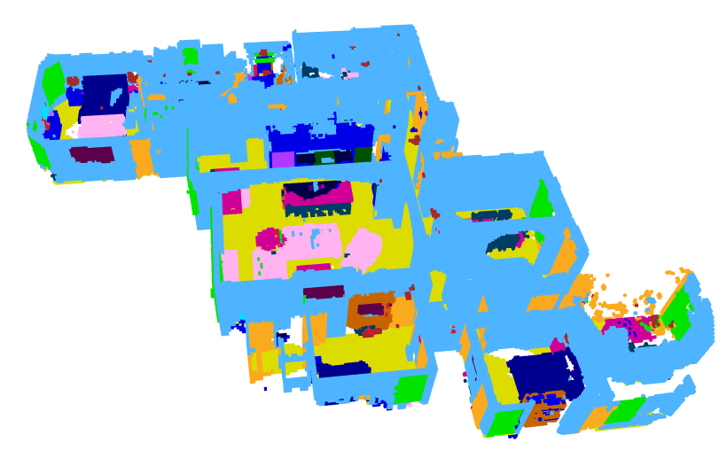

# MLN pipeline (iPPD)

The implimentation of iPPD pipeline of paper semantic map navigator.

## Preparation

### A. Prepare Data

#### Matterport3D Scenes (following [vlnce repo](https://github.com/jacobkrantz/VLN-CE/tree/e41ffc9ea6194655fa13f59e27f0868c4c67207a?tab=readme-ov-file))
Matterport3D (MP3D) scene reconstructions are used. The official Matterport3D download script (download_mp.py) can be accessed by following the instructions on their project webpage. The 90 scene data can then be downloaded:
```bash
# requires running with python 2.7
python download_mp.py --task habitat -o data/scene_datasets/mp3d/
```

#### VLNCE Dataset

debug 8WUmhLawc2A zsNo4HB9uLZ

### B. Preparing Env
```bash
conda create -n mp3d python=3.9 cmake=3.14.0
conda activate mp3d
```

#### install necessary packages
```bash
# for old version habitat-sim, recommand to use mamba
conda install -n base -c conda-forge mamba

conda install pytorch==1.13.1 torchvision==0.14.1 pytorch-cuda=11.7 -c pytorch -c nvidia

python -m pip install 'git+https://github.com/facebookresearch/detectron2.git'

mamba install habitat-sim=0.2.4 headless -c conda-forge -c aihabitat

mamba install -c conda-forge opencv
pip install open3d==0.14.1
pip install timm
```

#### place Mask2Former
```bash
mkdir external_lib 
cd external_lib
git clone https://github.com/facebookresearch/Mask2Former.git
cd Mask2Former
cd mask2former/modeling/pixel_decoder/ops
sh make.sh
```

## 1. Pre-exploration Phase and Semantic Map Constructor 
<details>
<summary>Details</summary>

#### a. download mask2former ckpt
Please place the checkpoint [link](https://dl.fbaipublicfiles.com/maskformer/mask2former/coco/panoptic/maskformer2_swin_large_IN21k_384_bs16_100ep/model_final_f07440.pkl) under ```map_generation/meta_data/mask2former_ckpt```
```bash
cd map_generation/meta_data/mask2former_ckpt
wget https://dl.fbaipublicfiles.com/maskformer/mask2former/coco/panoptic/maskformer2_swin_large_IN21k_384_bs16_100ep/model_final_f07440.pkl

```

#### b. run the script

```bash
sh run_recon.sh
```
Here is a sample of reconstructed semantic map



</details>

## 2. Key Component Extraction

[x] add extraction code of rule-based extractor
[x] add extraction code of GPT3.5 extractor

## 3. generate trajectories

> not requiring to generate compasss, might accelerate the generation

Training set do not require pruning
Evaluation set can be extracted from